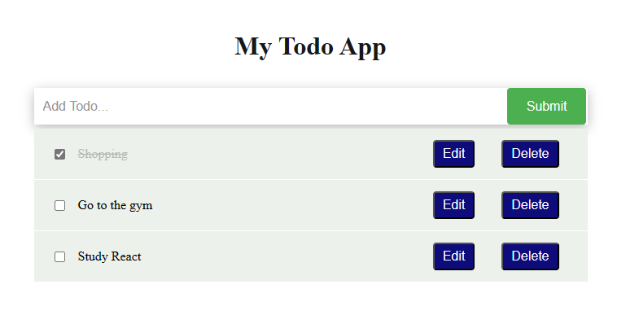

# React Todo App

# 📗 Table of Contents

- [📖 About the Project](#about-project)
  - [🛠 Built With](#built-with)
    - [Tech Stack](#tech-stack)
    - [Key Features](#key-features)
    - [🚀 Live Demo](#live-demo)
- [💻 Getting Started](#getting-started)
  - [Setup](#setup)
  - [Prerequisites](#prerequisites)
  - [Install](#install)
  - [Usage](#usage)
  - [Run tests](#run-tests)
  - [Deployment](#triangular_flag_on_post-deployment)
- [👥 Authors](#authors)
- [🔭 Future Features](#future-features)
- [🤝 Contributing](#contributing)
- [⭐️ Show your support](#support)
- [🙏 Acknowledgements](#acknowledgements)
- [📝 License](#license)

<!-- PROJECT DESCRIPTION -->

# 📖 [React-Todo-App ] 

**React-Todo-App!** Welcome to my Todo web application

Stay organized and increase productivity with our intuitive to-do-list web app. Add, edit, and delete tasks with clear all functionality from any device.

## 🛠 Built With <a name="built-with">

- HTML
- CSS
- JavaScript
- React
- Vite

</a>

### Tech Stack 

<!-- Features -->

### Key Features 

- **[Good and Simple Design]**
  **[Add & Remove Tasks easliy]**
  **[Intractive Application]**

(<a href="#readme-top">back to top</a>)

## 🚀 Live Demo 

- [It's comming soon]

(<a href="#readme-top">back to top</a>)

## 💻 Getting Started 

To get a local copy up and running, follow these steps.

### Prerequisites

In order to run this project you need:

- browser like google chrome

### Setup

- Clone this repository to your desired folder:

- clone the project using by running the following command :

`git clone`
`https://github.com/Jawad-Nazari/React-Todo-App`

<!-- AUTHORS -->

## 👥 Authors 

👤 **Jawad Nazari**

- GitHub: [@Jawad-Nazari](https://github.com/Jawad-Nazari)
- LinkedIn: [Jawad-Nazari](https://www.linkedin.com/in/Jawad-Nazari)
- Twitter: [@nazari_jawad58](https://twitter.com/nazari_jawad58)

(<a href="#readme-top">back to top</a>)

<!-- FUTURE FEATURES -->

## 🔭 Future Features 

# **[Feature-1]**

- More options like setting date will be added

(<a href="#readme-top">back to top</a>)

<!-- CONTRIBUTING -->

## 🤝 Contributing 

Contributions, issues, and feature requests are welcome!

Feel free to check the [issues page](../../issues/).

(<a href="#readme-top">back to top</a>)

<!-- SUPPORT -->

## ⭐️ Show your support 

Give a ⭐️ if you like this project!

(<a href="#readme-top">back to top</a>)

<!-- ACKNOWLEDGEMENTS -->

## 🙏 Acknowledgments 

I would like to thank Microverse.

(<a href="#readme-top">back to top</a>)

<!-- LICENSE -->

## 📝 License 

This project is [MIT](./LICENSE) licensed.

(<a href="#readme-top">back to top</a>)

